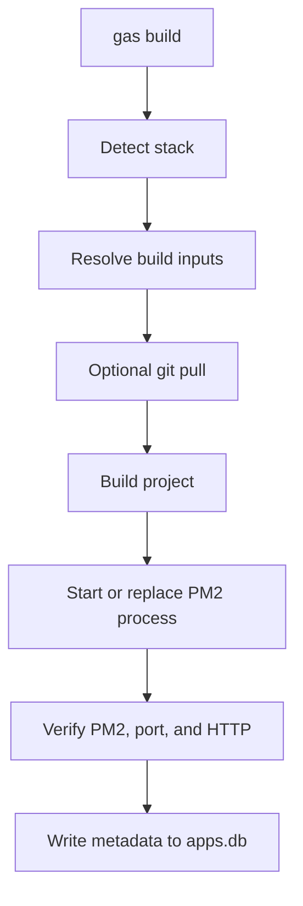
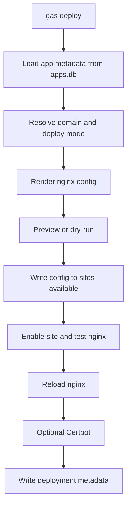

# GAS Architecture

## Gambaran Desain

`gas-cli` dibangun sebagai CLI Bash modular. Entry point dibuat tipis, sedangkan logika utama dibagi ke file `lib/*.sh` berdasarkan domain masalah. Pilihan ini penting karena project harus tetap mudah dikembangkan meskipun command surface bertambah.

Secara konsep, arsitektur `gas` berdiri di atas empat pilar:

- deteksi project dan build strategy
- manajemen proses dengan PM2
- manajemen web routing dengan Nginx
- metadata global dengan SQLite

## Peta Modul

Struktur inti project:

- `bin/gas`
- `lib/core.sh`
- `lib/ui.sh`
- `lib/detect.sh`
- `lib/ecosystem.sh`
- `lib/pm2.sh`
- `lib/nginx.sh`
- `lib/db.sh`
- `lib/build.sh`
- `lib/deploy.sh`
- `lib/help.sh`
- `lib/commands.sh`

Peran tiap modul:

- `bin/gas`
  Entry point. File ini hanya me-resolve root, me-source modul, lalu memanggil `main`.
- `lib/commands.sh`
  Dispatcher command dan handler command non-build/deploy seperti `info`, `list`, `restart`, `logs`, dan `rebuild`.
- `lib/core.sh`
  Menyimpan global state, helper logging, validasi port, mode UI, dan helper shell umum.
- `lib/detect.sh`
  Menangani stack detection, environment port detection, package manager detection, dan node entry detection.
- `lib/ecosystem.sh`
  Menemukan dan membaca file ecosystem PM2, lalu menentukan apakah config akan direuse atau digenerate.
- `lib/pm2.sh`
  Integrasi PM2, replace-and-start logic, dan runtime verification.
- `lib/nginx.sh`
  Helper privileged write ke Nginx, enable atau disable site, backup config, test, reload, dan Certbot.
- `lib/db.sh`
  Seluruh operasi SQLite: migrasi ringan, query metadata, dan upsert record.
- `lib/build.sh`
  Workflow `gas build`.
- `lib/deploy.sh`
  Workflow `gas deploy`, render config, preview, verify, list, remove, dan doctor.

## Metadata Storage

Metadata global disimpan di:

```text
~/.config/gas/apps.db
```

Pemilihan SQLite memberi beberapa keuntungan:

- state lintas project bisa dipakai dari mana saja
- tidak perlu file metadata lokal di tiap repo
- query sederhana tetap mudah dilakukan
- migrasi schema ringan bisa dilakukan saat runtime

## apps.db dan Tabel Yang Dipakai

Database saat ini punya tiga tabel utama:

### `apps`

Menyimpan hasil build terakhir per `project_dir`. Field penting:

- `project_dir`
- `app_type`
- `port`
- `pm2_name`
- `env_file`
- `start_file`
- `run_mode`
- `node_version`
- `npm_version`
- `go_version`
- `svelte_strategy`
- `deps_mode`
- `verify_status`
- `verify_message`
- `updated_at`

Tabel ini dipakai oleh:

- `gas info`
- `gas list`
- `gas rebuild`
- `gas deploy`

### `domains`

Tabel legacy untuk metadata domain lama. Tetap dipertahankan demi kompatibilitas.

### `deployments`

Tabel deployment yang lebih kaya. Field penting:

- `domain`
- `project_dir`
- `pm2_name`
- `port`
- `server_type`
- `deploy_mode`
- `ssl_mode`
- `canonical_host`
- `alias_domains`
- `app_map`
- `nginx_conf_path`
- `enabled`
- `notes`
- `created_at`
- `updated_at`

## Migrasi Ringan

Saat `ensure_metadata_db` dipanggil, `gas`:

1. membuat tabel jika belum ada
2. mengecek apakah tiap kolom penting sudah tersedia
3. menambahkan kolom yang belum ada dengan `ALTER TABLE`

Artinya, schema evolution dilakukan secara best-effort di runtime. Ini konsisten dengan tujuan project: perubahan metadata harus kompatibel dan tidak menuntut migrasi berat.

## Stack Detection

Build flow bergantung pada stack detection dari `lib/detect.sh`. Heuristiknya sederhana tetapi pragmatis:

- Go: `go.mod`, `main.go`, atau `cmd/*/main.go`
- SvelteKit: `@sveltejs/kit`
- Next.js: `next`
- Nuxt: `nuxt`
- Vite: `vite`
- Node generic: ada `package.json`
- Mixed: Go dan Node sekaligus
- Unknown: sinyal tidak cukup

Selain framework, modul yang sama juga mendeteksi:

- `PORT` dari `.env` atau `.env.production`
- package manager dari lockfile
- candidate file output server untuk strategy `node-entry`

## PM2 Integration

PM2 adalah runtime manager utama. Integrasinya dibagi menjadi dua bentuk:

- direct start, misalnya menjalankan binary Go langsung
- replace-and-start, misalnya menjalankan `pm2 start npm ...` atau ecosystem file

Helper penting di `lib/pm2.sh`:

- `pm2_app_exists`
- `run_pm2_direct`
- `pm2_replace_and_start`
- `detect_pm2_status`
- `verify_runtime`

Strategi ini sengaja defensif. Untuk beberapa mode Node, `gas` memilih delete lalu start ulang agar command runtime benar-benar sinkron dengan strategy baru, bukan sekadar restart process lama dengan parameter yang mungkin sudah tidak relevan.

## Runtime Verification

Salah satu aspek paling penting dari arsitektur ini adalah verifikasi runtime setelah build. `gas` tidak berhenti pada asumsi "build sukses berarti service sehat".

Verifikasi saat ini mencakup:

- status PM2 harus `online`
- port target harus listen
- HTTP localhost dicoba bila `curl` tersedia

Hasil verifikasi disimpan ke metadata. Ini memungkinkan operator melihat status build terakhir lewat `gas info` tanpa harus mengandalkan ingatan manual.

## Nginx Integration

Integrasi Nginx diisolasi ke `lib/nginx.sh` dan bagian render di `lib/deploy.sh`.

Fungsi utamanya:

- menulis config ke `/etc/nginx/sites-available/<domain>`
- membuat symlink ke `sites-enabled`
- backup config lama
- test `nginx -t`
- reload service
- menulis catchall 444 bila diminta
- memanggil Certbot untuk mode `certbot-nginx`

Semua operasi file sistem dilakukan lewat helper `run_privileged_shell`, yang akan memakai root langsung atau `sudo`. Ini menjaga logika privilege tetap terpusat.

## Render Engine Deploy

`gas deploy` bekerja sebagai renderer konfigurasi berbasis metadata dan mode. Input utamanya:

- domain utama dan alias
- app yang dipilih
- deploy mode
- opsi proxy, cache, security headers, SSL, dan verification

Mode deploy yang benar-benar didukung:

- `single-app`
- `frontend-backend-split`
- `custom-multi-location`
- `static-only`
- `redirect-only`
- `maintenance`

Pilihan `apache` muncul di UX sebagai arah masa depan, tetapi belum diimplementasikan. Itu harus diperlakukan sebagai planned feature, bukan capability runtime saat ini.

## Flow Internal gas build

Berikut alur ringkas `gas build`:



Untuk Go, tahap build menghasilkan binary di `.gas/bin/`. Untuk Node, tahap build bisa menghasilkan reuse ecosystem, generated ecosystem, direct node entry, `npm run start`, atau `npm run preview`.

## Flow Internal gas deploy

Alur `gas deploy` sedikit berbeda:



Deploy engine tidak bergantung langsung pada hasil parsing PM2 runtime. Ia mengandalkan metadata build sebagai sumber kebenaran operasional yang lebih stabil.

## UI dan Automation Mode

Arsitektur UI sengaja dibuat paralel, bukan tempelan:

- `NO_UI=0` dan terminal interaktif -> mode interaktif aktif
- bila `gum` ada -> pengalaman prompt lebih rapi
- bila `gum` tidak ada -> fallback plain terminal
- bila `--no-ui` aktif -> jalur automation

Konsekuensinya, fungsi inti build dan deploy tidak boleh bergantung pada side effect UI. UI hanya mengisi input, sedangkan eksekusi tetap berada di modul domain.

## Kenapa bin/gas Tetap Tipis

Entrypoint yang tipis adalah keputusan arsitektural penting. `bin/gas` hanya:

1. menentukan `ROOT_DIR`
2. me-source semua modul
3. memanggil `main`

Keuntungan pendekatan ini:

- command dispatch tetap terpusat
- test mental model lebih sederhana
- penambahan fitur baru tidak membuat entrypoint menjadi monolitik

## Implikasi Untuk Maintainer

Jika Anda akan mengembangkan `gas-cli`, pola yang sebaiknya dijaga adalah:

- logika baru masuk ke modul domain, bukan ke entrypoint
- perubahan schema database tetap backward compatible
- mode interaktif dan `--no-ui` harus selalu dipikirkan bersama
- jangan klaim build atau deploy sukses tanpa verifikasi nyata

Arsitektur project ini bukan framework abstrak besar. Ia lebih mirip kumpulan workflow operasional yang dibungkus rapi. Justru karena itu, konsistensi modul, metadata, dan verifikasi runtime menjadi fondasi utamanya.
